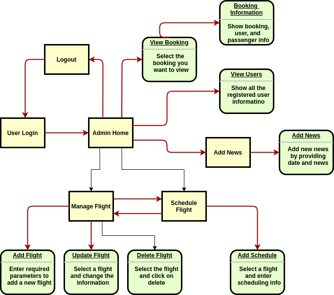
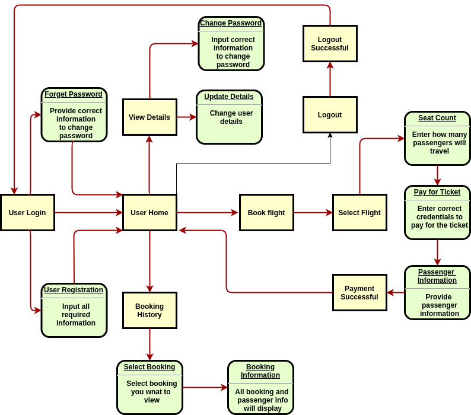

# Airline Ticket Reservation System

## Flow Diagram

> Admin 

<p align="center">
    
</p>

> User

<p align="center">
    
</p>

## Demo

> Admin Home and News

<p align="center">
    
</p>

> User Home and Update Profile

<p align="center">
    
</p>

> User Registration and Account Recovery

<p align="center">
    
</p>

> Manage Flight

<p align="center">
    
</p>

> Schedule Flight

<p align="center">
    
</p>

> Book Flight and Booking Details

<p align="center">
    
</p>

## How to use

Check out the deployed application in **Heroku** from [here](https://airline-ritam.herokuapp.com/)

Or 

Download the jar from [here](https://github.com/RitamChakraborty/airline_ticket_reservation_system/releases/download/v1.0.0-alpha/airline_ticket_reservation_system-1.0.0-alpha.jar)

Make sure `Java11` is installed in your system and run it with the command

```shell script
java -jar airline_ticket_reservation_system-1.0.0-alpha.jar
```

> **Note**
> <br>admin *username*: `ritam`
> <br>admin *password*: `password`
> <br>You can sign up as new user

## Contributors

- [Afrin Kadher](https://github.com/AfrinKadher)
- [Kunal Goel](https://github.com/kunalgoel313)
- [Pallavi Gupta](https://github.com/Pallavigupta02)
- [Ritam Chakraborty](https://github.com/RitamChakraborty)
- [Shuktika Mahanty](https://github.com/Shuktika15) 
 